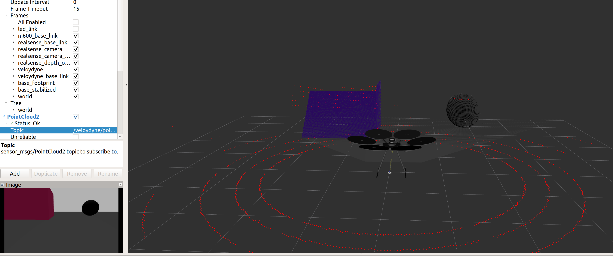

dji_ros_simulator
=========

This repository contains the necessary files for simulating DJI drones in ROS and Gazebo. It currently contains DJI M100 and DJI M600 models.
This package is meant for Hardware in the Loop simulations where DJI drone is connected and DJI ROS SDK is running.

**Dependencies**
- DJI Onboard SDK-ROS https://github.com/dji-sdk/Onboard-SDK-ROS
- sensor packages of the simulated sensors:

 + Velodyne Lidar (VLP-16): it depends on [velodyne_simulator](http://wiki.ros.org/velodyne_simulator "velodyne_simulator") package

 + Inte Realsense Camera (D435): it depends on [realsense_description](https://github.com/TareqAlqutami/realsense_description "realsense_description") package

- message_to_tf package http://wiki.ros.org/message_to_tf

**Installation**

- Install all the dependencies
- Clone this package into your catkin workspace and build it

**Usage**
- Connect a DJI drone and run DJI sdk ros node.
- Run the simulation roslaunch:
  > `roslaunch dji_gazebo sim_{drone model}.launch`

  where `{drone model}` is either m100 or m600.

  - You can select which sensor to simulate using the roslaunch arguments:
    > `roslaunch dji_gazebo sim_m600.launch lidar:=false realsense:=true  realsense_name:=d435`

  - You can add/modify sensors to the drone inside the urdf files `dji_drone_description/urdf/dji_{drone model}_sensors.urdf.xacro` in `dji_drone_description` package
  - You can modify the arguments of dji_gazebo_bridge node from roslaunch directly. For example, to change the drone name or to disable set_local_pos_ref service in dji sdk.
