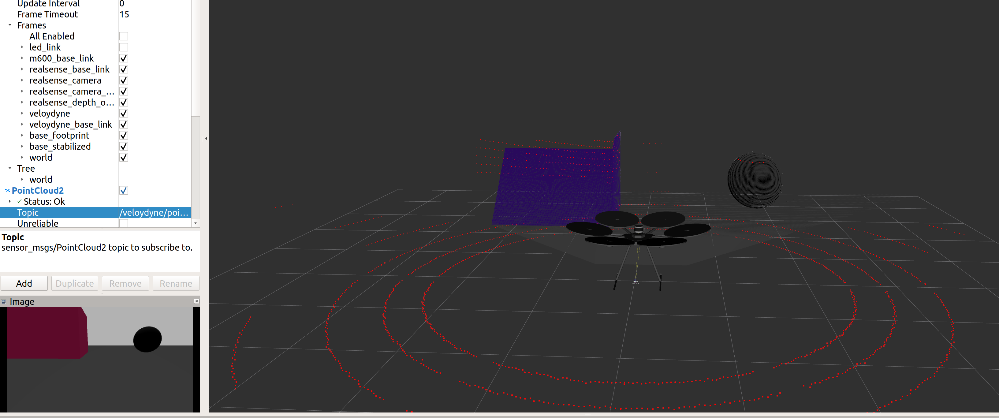

dji_drone_description
=========

This package contains the necessary files for simulating DJI drones in ROS and Gazebo. It currently contains DJI M100 and DJI M600 models.
This package is meant for Hardware In the Loop simulations where DJI drone is connected and DJI ROS SDK is running.

**Installation**

Clone this package into your catkin workspace and build the workspace.
The package depends of other packages for simulating sensors attached to the drone.
Current models have the following sensors:
 - Velodyne Lidar (VLP-16): it depends on [velodyne_simulator](http://wiki.ros.org/velodyne_simulator "velodyne_simulator") package
 - Inte Realsense Camera (D435): it depends on [realsense_description](https://github.com/TareqAlqutami/realsense_description "realsense_description") package

The Gazebo simulations also depend on message_to_tf package http://wiki.ros.org/message_to_tf

**Usage**
 - To view the drones in rviz:
  > `roslaunch dji_drone_description view_{drone model}_model.launch`

 - To view the drones with top veloydyne and front realsense sensors attached:
  > `roslaunch dji_drone_description view_{drone model}_sensors_model.launch`  

  where `{drone model}` is either m100 or m600.

 - To spawn the drone in gazebo and get simulated sensor data:
   > `roslaunch dji_drone_description spawn_{drone model}.launch`

 - You can select which sensor to simulate using the roslaunch arguments:
   > `roslaunch dji_drone_description spawn_m600.launch lidar:=false realsense:=true  realsense_name:=realsense_d435`

 - You can add/modify sensors to the drone inside the urdf files `dji_{drone model}_sensors.urdf.xacro`

**Simulation in Gazebo and Connection to the Drone**
 Use the launch files in dji_gazebo package to connect the drone to dji sdk.
